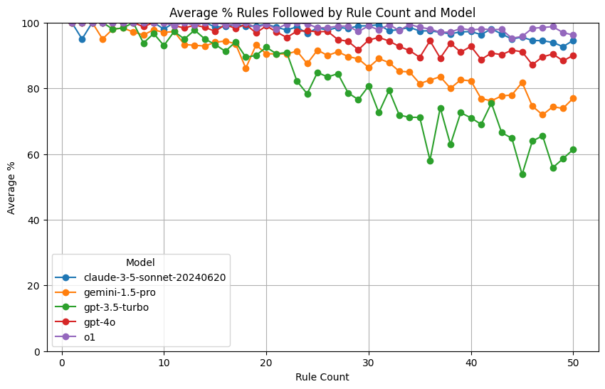

# LLM Rules Attention Experiment

This project explores how well different Large Language Models (LLMs) can handle and follow multiple rules or constraints within a prompt. The experiment tests various models' ability to maintain attention and compliance as the number of rules increases.

## Overview

The experiment works by:
1. Providing LLMs with a list of entities (e.g., 'museum', 'mountain')
2. Asking them to write text that mentions these entities
3. Gradually increasing the number of required entities
4. Evaluating how well models maintain compliance as complexity grows

Models tested:
- GPT-3.5 Turbo (OpenAI)
- GPT-4 (OpenAI)
- Gemini Pro 1.5 (Google)
- Claude 3 Sonnet (Anthropic)

## Setup

1. Clone this repository
2. Install dependencies:
   ```bash
   pip install pandas openai anthropic google.generativeai python-dotenv
   ```
3. Create a `.env` file with your API keys:
   ```
   OPENAI_API_KEY=your_key_here
   ANTHROPIC_API_KEY=your_key_here
   GEMINI_API_KEY=your_key_here
   ```

## Running the Experiment

1. Open `rules_experiment.ipynb` in Jupyter Notebook
2. Run all cells to execute the experiment
3. Results will be saved in the `results/` directory, partitioned by model, sample size, and seed
4. The notebook includes visualization code to analyze the results

## Data Structure

- `rule_options.csv`: Contains the list of entities used in the experiment
- `results/`: Directory containing experiment results partitioned by model name

## Analysis

The experiment measures:
- Percentage of rules followed correctly
- How performance degrades with increasing rule count
- Differences between models in handling complex instructions

Results are visualized showing how each model's performance changes as the number of rules increases:

